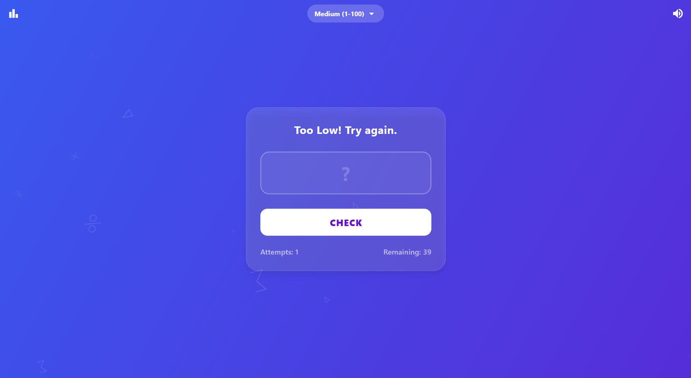
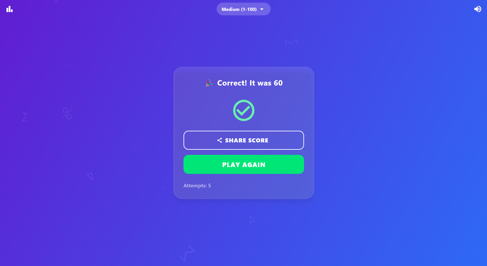
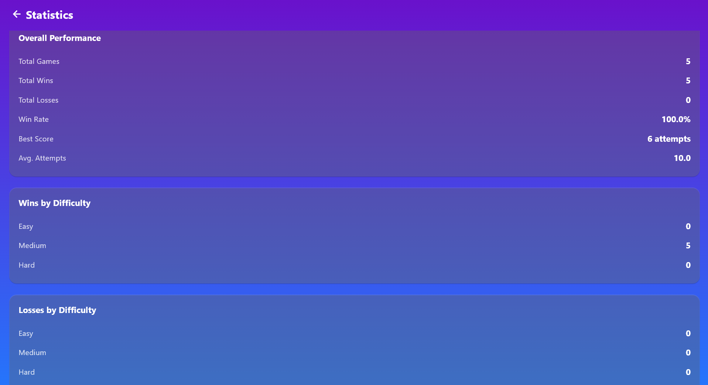
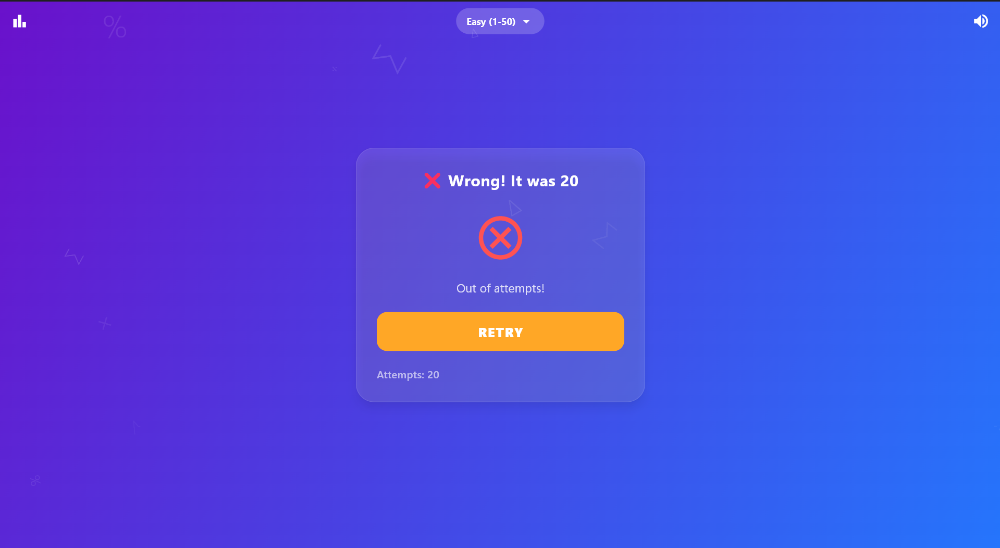

# 🎮 Number Guessing Game

A beautiful and interactive number guessing game built with Flutter, featuring smooth animations, difficulty levels, and comprehensive statistics tracking.


## ✨ Features

- 🎯 **Three Difficulty Levels**
  - Easy: 1-50 (20 attempts)
  - Medium: 1-100 (40 attempts)
  - Hard: 1-500 (60 attempts)

- 📊 **Comprehensive Statistics**
  - Total games, wins, and losses
  - Win rate percentage
  - Best score tracking
  - Performance breakdown by difficulty

- 🎨 **Beautiful UI/UX**
  - Animated gradient background
  - Floating math symbols
  - Smooth transitions and animations
  - Shake effect on wrong guesses

- 🔊 **Interactive Feedback**
  - Sound effects (correct/wrong)
  - Haptic vibration on mobile
  - Visual animations

- 📱 **Cross-Platform**
  - Android
  - iOS
  - Web
  - Windows

- 🎁 **Additional Features**
  - Share your score with friends
  - Sound toggle (mute/unmute)
  - Persistent statistics storage
  - Remaining attempts indicator

## 📸 Screenshots

   

## 🚀 Getting Started

### Prerequisites

- Flutter SDK (3.0 or higher)
- Dart SDK (3.0 or higher)
- Android Studio / VS Code
- Git

### Installation

1. Clone the repository
```bash
git clone https://github.com/Sridevbaag/number-guessing-game.git
```

2. Navigate to project directory
```bash
cd number-guessing-game
```

3. Install dependencies
```bash
flutter pub get
```

4. Run the app
```bash
flutter run
```

## 🏗️ Build for Production

### Android
```bash
flutter build apk --release
```

### iOS (requires Mac)
```bash
flutter build ios --release
```

### Web
```bash
flutter build web --release
```

### Windows
```bash
flutter build windows --release
```

## 📦 Dependencies

```yaml
dependencies:
  flutter:
    sdk: flutter
  audioplayers: ^6.1.0
  shared_preferences: ^2.3.3
  share_plus: ^10.1.2
  vibration: ^2.0.0
```

## 🎓 What I Learned

This project helped me learn:
- Flutter state management
- Animation controllers
- Cross-platform development
- Local data persistence
- Material Design 3
- Sound and haptic feedback integration

## 🛠️ Built With

- [Flutter](https://flutter.dev/) - UI framework
- [Dart](https://dart.dev/) - Programming language
- [Android Studio](https://developer.android.com/studio) - IDE

## 👨‍💻 Author

**Sridev Bag**
- GitHub: [@Sridevbaag](https://github.com/Sridevbaag)
- LinkedIn: [Add your LinkedIn]

## 📝 License

This project is open source and available under the [MIT License](LICENSE).

## 🙏 Acknowledgments

- Flutter team for the amazing framework
- Material Design for design guidelines
- All open-source contributors

## 🚀 Future Enhancements

- [ ] Add multiplayer mode
- [ ] Implement leaderboard system
- [ ] Add more themes
- [ ] Support for multiple languages
- [ ] Add achievement system
- [ ] Dark mode support

---

Made with ❤️ by Sridev Bag
